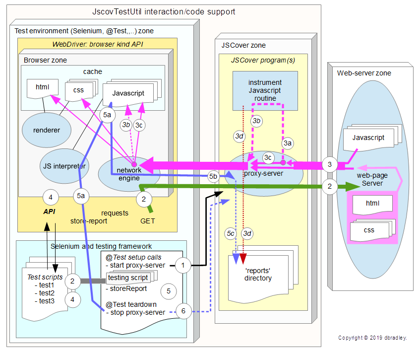

# JscovTestUtil
Java Selenium 3 class for javascript code coverage utility using JSCover

[JscovTestUtil basic documentation](https://DaveBrad.github.io/prjdoc/jscovtestutil/jtuhow.html)

Provides a library class to use in Java Selenium to use JSCover to do code coverage on javascript as instrumented on-the-fly.
JSCover primer: JSCover is used as an external program which uses a local proxy service to HTTP 'get' files from the web-server. 
A proxy process will instrument the javascript files as they are provided to the browser.

This is very useful class to test IoT device(s) that support a simple web-server capability (such as an ESP8266). JSCover may be used
for any web-server, but be aware that it has limitations.

JSCover provides the ability to launch a browser to view reports of the Javascript files code coverage.

(Letters a, b, c and d are represented by i, ii, iii and iv in the below text.)

<ol>
<li><i>Test setup</i>:
<ul><li>Start the proxy-server via ProcessBuilder using the JSCover
executable directory.</li></ul>
</li>
<li><i>Testing</i>:
<ul><li>Begin executing tests, perform GET-URL action.
<ul><li>
<i>Proxy-server</i>: passes <b>GET</b> requests directly to web-server.
</li></ul>
</li></ul>
</li>
<li><i>Web-server</i>:
<ul><li>Respond to <b>GET</b> requests and sends files back to requestor (for
files: HTML, CSS, JS,...).</li></ul>
<ol type="a">
<li><i>Proxy-server</i>: Javascript file(s) are intercepted by JSCover
proxy-server and instrumented, if not excluded from instrumentation.</li>
<li><i>Proxy-server</i>: Instrumented files are forwarded to browser.</li>
<li><i>Proxy-server</i>: Excluded from instrumentation files are passed-through to
the browser.</li>
<li><i>Proxy-server</i>: Records the original Javascript and retains them in
the JSCover reports directory.</li>
</ol>
</li>
<li><i><b>Testing</b></i>:
<ul><li>
<b>Performs normal test actions via the WebDriver API.</b>
</li></ul></li>
<li><i>Testing/capture report</i>:
<ul><li>invoke a store-report at end of each test, or during testing, or
whenever.</li></ul>
<ol type="a">
<li><i>Instrumented Javascript</i>: Invoke the jscoverage_report(...)
function in the instrumented Javascript. This will cause the script to
forward captured results to the proxy-server directly.</li>
<li><i>Proxy-server</i>: Receives jscoverage JSON and other datum which will
be formatted and converted into JSCover report format files.
</li>
<li><i>Proxy-server</i>: Report-files are stored in the JSCover reports
directory. JSCover will also merge the data if existing datum files
present.</li>
</ol>
</li>
<li><i>Testing/stop</i>:
<ul><li>On testing stop a request to terminate and stop the proxy-server is
"called". This will cause a store-report first before stopping the JSCover
proxy-server process on the system.
</li></ul></li>
</ol>

Why Netbeans project?

JscovTestUtil interacts with external programs: a-browser, JSCover proxy-server,
and a pseudo web-server. Testing once through all these interactions involves
integration tests, rather than unit tests.

TestNG is used to cause tests to be run sequentially.
